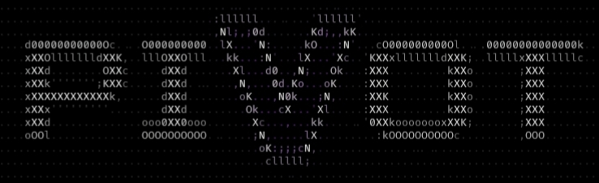

<<<<<<< HEAD
<p align="center">
  
</p>

# ⚙️ Pivot
A modified memory editor built on top of GameGuardian with extended features, LuaJava support, and system-level tooling enhancements.

---

## 🧠 Overview
- Extended scripting capabilities (Lua / LuaJava)
- Improved memory manipulation tooling
- Compatibility aligned with Void ecosystem updates
=======
# Pivot

GameGuardian-style mod for Android — Lua scripting, WebView bridge, and script tooling.

## Build

```
java -jar tools/apktool/apktool.jar b src -o Pivot.apk
zipalign -f -p 4 Pivot.apk Pivot-aligned.apk
apksigner sign --ks <keystore> --out Pivot-signed.apk Pivot-aligned.apk
```

## Example scripts

- `pivot_web_login.lua` — WebView login panel demo (`gg.webview`, JS bridge + `pivot://` deeplink)
- `pivot_decrypt_menu.lua` — script picker; runs target scripts and reconstructs their `gg.*` calls

## New APIs

- `gg.webview(source [, title]) -> string|nil` — real WebView (URL or inline HTML), blocking; page JS calls `window.Pivot.send(str)` or navigates to `pivot://...` to return data to Lua
- `gg.decryptScript(source [, outPath])` — runs a script in an isolated state, captures its gg-call trace / print output, optionally saves
- `gg.listFiles(path) -> table` — directory listing
- `gg.dumpProto(path)`, `gg.dumpScriptStrings(path)` — bytecode inspection
- `gg.htmlDialog(html [, title])` — HTML dialog via Html.fromHtml
>>>>>>> f82c4d6 (Add README)
